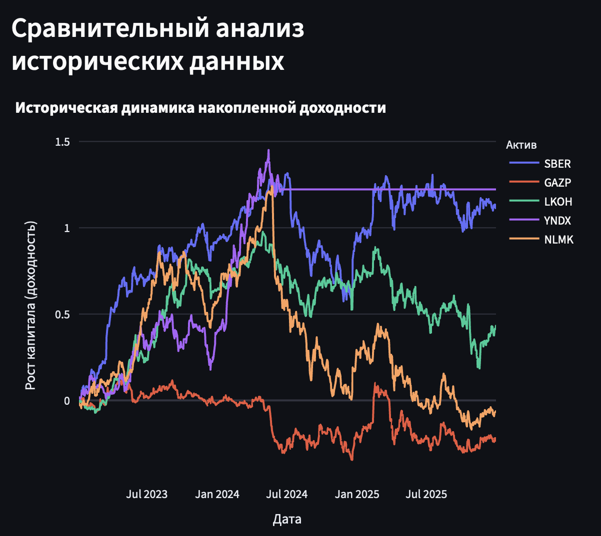

# Portfolio Optimization System (MOEX Edition)



An automated asset allocation engine that implements Modern Portfolio Theory (MPT) to find mathematically optimal portfolio weights by maximizing risk-adjusted returns for Russian equities.

> **Status:** Active / Production-ready Portfolio Project  
> **Core Concept:** $\max_w \; w^T \mu - \lambda w^T \Sigma w$ (Maximizing expected return while controlling for covariance risk).

---

## System Architecture & Modularity

Unlike monolithic scripts, this system is built using clean, industrial software engineering principles with strict separation of concerns:

* `src/loader.py`: Automated data pipeline interacting directly with the **Moscow Exchange (MOEX) ISS API** via `apimoex`.
* `src/optimizer.py`: Core mathematical engine. Computes annualized expected returns ($\mu$), covariance matrix ($\Sigma$), and runs quadratic optimization (`SLSQP`) under strict budget constraints (no short-selling, $\sum w_i = 1$).
* `src/visualizer.py`: Data visualization layer built on `Plotly` to generate interactive donut charts and cumulative historical return lines.
* `app.py`: Interactive user interface powered by `Streamlit`.

---

## Features

* **Real-time MOEX Data:** Fetches clean historical daily candles straight from the main trading mode (TQBR).
* **Risk Aversion Tuning:** Dynamic $\lambda$ parameter slider allows simulation of different investor profiles (from aggressive to highly risk-averse).
* **Asset Filtering:** Efficiently drops assets that degrade the portfolio's Sharpe ratio / utility function.
* **Advanced Visuals:** Tracks how 1 ₽ invested historically would grow across selected assets.

---

## Quick Start

1. **Clone the repository:**
    ```bash
    git clone https://github.com/abrenmarie/portfolio-optimization-system.git
    cd portfolio-optimization-system
    ```

2. **Set up environment & Install dependencies:**
    ```bash
    # Create virtual environment
    python -m venv .venv

    # Activate environment (Mac/Linux)
    source .venv/bin/activate
    # Or on Windows (PowerShell)
    # .venv\Scripts\Activate.ps1

    # Install required packages
    pip install -r requirements.txt
    ```

3. **Run the Dashboard:**
    ```bash
    streamlit run app.py

---

## Tech Stack & Mathematical Tools

* **Optimization Solver:** `SciPy` (Sequential Least Squares Programming / SLSQP)
* **Data Analysis & Math:** `Pandas`, `NumPy`
* **API Integration:** `requests`, `apimoex` (Moscow Exchange ISS API)
* **Frontend & Interactive Plots:** `Streamlit`, `Plotly Express`